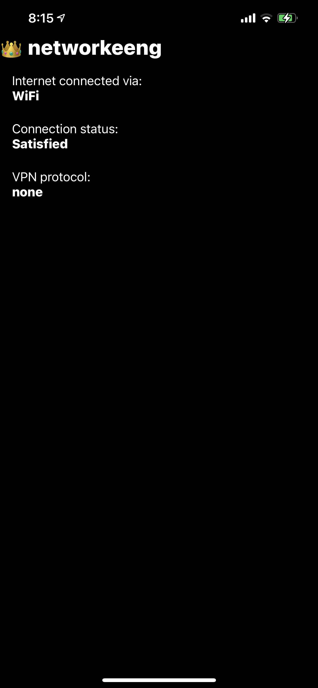
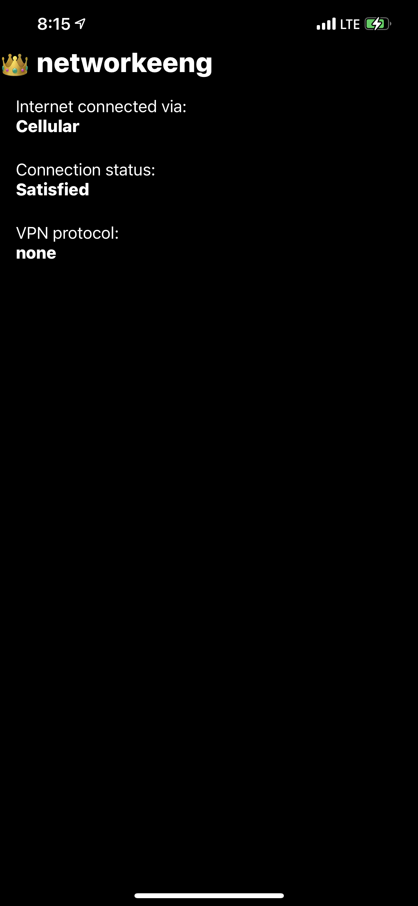
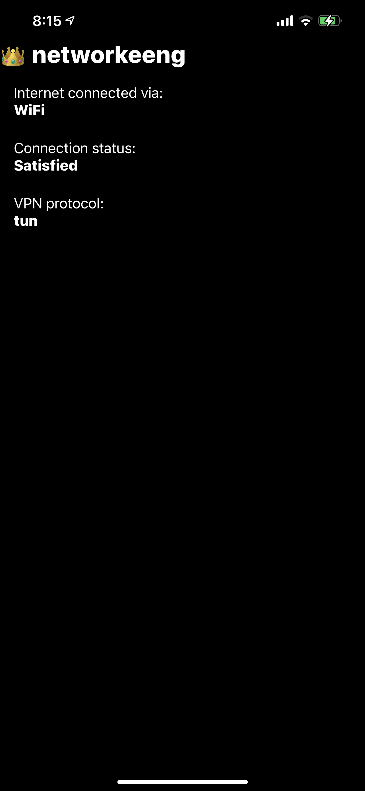
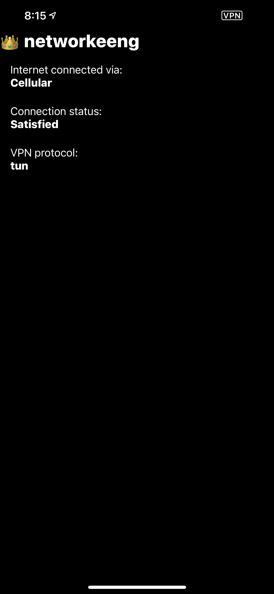
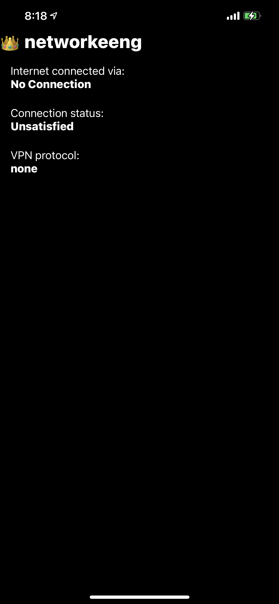

# 👑 networkeeng

[](https://app.bitrise.io/app/739b590ab2f1834f)

<br />

|WiFi-No VPN|Cellular-No VPN|
|-|-|
|||

|WiFi-VPN|Cellular-VPN|
|-|-|
|||

|No Connection|
|-|
||

**Code Style**<br />
[Swift Style Guide from Google](https://google.github.io/swift/)<br /><br />

**Code linter and formatter**<br />
I use [swift-format](https://github.com/apple/swift-format) for this project as I need to use a custom tab indentation and spacing.<br />
Here are some commands I used during testing.
```javascript
swift-format demo/*.swift --configuration .swift-format.json --in-place
swift-format networkeeng/*.swift --configuration .swift-format.json --in-place
```
<br />

**Some good articles**<br />
[How to start working with swift-format](https://exyte.com/blog/how-to-start-working-with-swift-format)<br />
[Swift Code Formatters](https://nshipster.com/swift-format/)<br /><br />

**💡 Tips**<br />
Here's a code snippet when formatting a long String so that swift-format doesn't complain.
```javascript
let singleLineText =
"""
fames ac turpis egestas sed tempus urna et pharetra pharetra massa massa \
ultricies mi quis hendrerit dolor magna eget est lorem ipsum dolor sit amet\
consectetur adipiscing elit pellentesque habitant morbi tristique senectus \
et netus et malesuada fames ac turpis egestas integer eget aliquet nibh \
praesent tristique magna sit amet
"""

let multilineText =
"""
fames ac turpis egestas sed tempus urna et pharetra pharetra massa massa
ultricies mi quis hendrerit dolor magna eget est lorem ipsum dolor sit amet
consectetur adipiscing elit pellentesque habitant morbi tristique senectus
et netus et malesuada fames ac turpis egestas integer eget aliquet nibh
praesent tristique magna sit amet
"""
```
<br />

**ℹ️ Note**<br />
This is my first time to try an open-source project and I appreciate your feedback or pointing me to the right direction to make `networkeeng` help the iOS open-source community.
